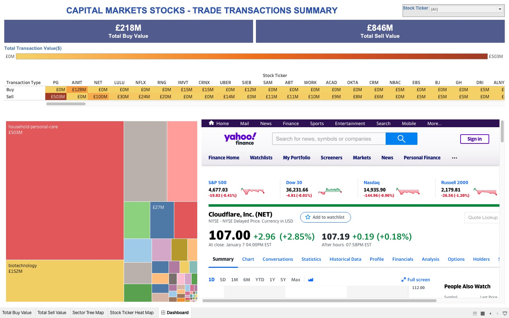

# capital_markets_stocks_trade_transactions_tableau_dashboard

<h3>This project includes the data analysis related to the capital stock market trade transactions data using Tableau Desktop and results are visualized in the form of a Dynamic Tableau Dashboard.</h3>

<h3> This Tableau Dashboard is inspired and learned from the youtube channel link "https://www.youtube.com/watch?v=SnzwO4vEkJE" and recreated as part of the Tableau learning journey.

 
 
 
  

